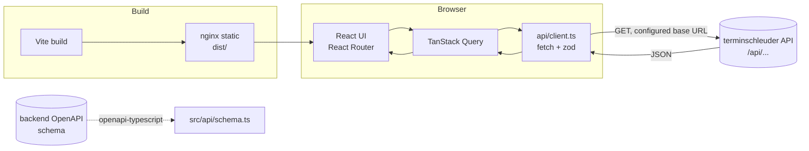
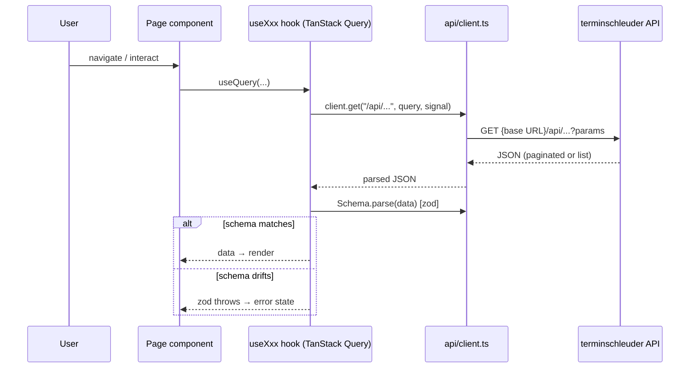
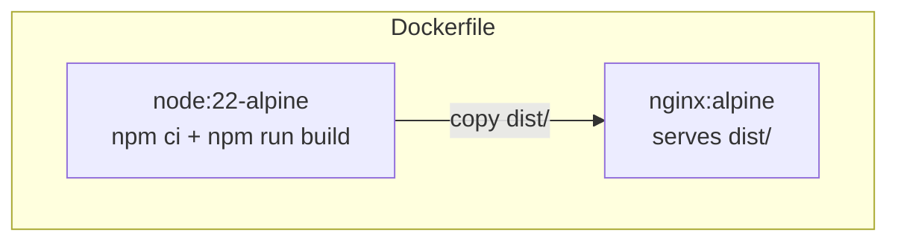

# Architecture

## Purpose

The terminschleuder **demo client** is a **read-only, unauthenticated** React SPA that
demonstrates *everything a public customer can do* against the
[terminschleuder](../../backend) events API: browse the city catalog, search events,
filter by proximity / city / org / type / attendance / date, page through results, inspect
event detail with hero images and provenance, and explore organizations, venues, and
categories — plus an interactive Leaflet map and geolocation.

It is a **completely distinct project** from the backend (own folder, own git repo). It
**never authenticates or writes**; it only issues `GET` requests to the read-only public
endpoints. There is intentionally no register/login/token/api-keys UI — those are not
"unauthenticated customer" behaviour.

## The defining constraint: origin-agnostic, runtime-configured API URL

A single built image must run against *any* backend (local, staging, prod) with no
rebuild. The API base URL is therefore adjustable at runtime, not fixed per deploy:

- The demo ships with a **built-in default** (`https://terminschleuder.online`) so it
  renders data on first load with **no onboarding prompt**.
- A user-set URL is persisted to `localStorage` (`terminschleuder.demo.apiBaseUrl`) and
  always wins over the built-in default.
- It can be changed any time from the **Settings** page (gear icon); "Reset to default"
  reverts to the built-in URL.
- `VITE_DEFAULT_API_URL` overrides the built-in default at build time (e.g. to point a
  deploy at a staging backend, or set it to `""` to restore the first-run onboarding
  prompt) — but the runtime value in `localStorage` always wins.

The backend enables CORS for read-only `GET/HEAD/OPTIONS` from all origins, so the SPA
calls the configured URL directly from the browser (no same-origin proxy needed). An
optional `/api/` reverse proxy is commented out in `nginx.conf` for same-origin deploys.

## High-level data flow



## Request lifecycle



Key points:

- **`useApiClient`** builds an `ApiClient` memoized on `baseUrl`. TanStack Query keys
  embed `baseUrl`, so changing the API URL **invalidates and refetches everything**.
- **zod schemas** (`src/api/schemas.ts`) validate every list/detail response at runtime —
  a cheap **drift detector**. If the API and the schema disagree, zod throws and the UI
  shows a visible error instead of rendering garbage.
- **`AbortSignal`** is threaded from TanStack Query into `fetch`, so navigating away
  cancels in-flight requests.

## Tech stack

| Layer | Choice | Notes |
| --- | --- | --- |
| Build | Vite 6 | dev server + production bundler |
| UI | React 19 + TypeScript (`strict`) | React Router v7 |
| Data | TanStack Query v5 | caching, pagination, loading/error/empty states |
| Styling | Tailwind CSS v4 | shadcn-style primitives, dark mode toggle |
| Maps | react-leaflet v5 + Leaflet | OpenStreetMap tiles, geolocation; **lazy-loaded** |
| Validation | zod | runtime response-shape validation (drift detector) |
| Types | openapi-typescript | generated from backend OpenAPI → `src/api/schema.ts` |
| Tests | Vitest 3 + RTL + MSW | jsdom; MSW mocks the API |
| Serve | nginx (multi-stage Docker) | static `dist/`, SPA fallback, gzip, asset caching |

> **`vitest`'s major must stay in sync with `vite`'s major** — they share a transform
> pipeline; a mismatch silently breaks test loading. Bump them together.

## Configuration

All optional, build-time via `.env` (see `.env.example`). The runtime API URL set in
the browser always wins — these only override the built-in default
(`https://terminschleuder.online`).

| Variable | Default | Purpose |
| --- | --- | --- |
| `VITE_DEFAULT_API_URL` | `https://terminschleuder.online` | Overrides the built-in default API URL used on first run. Set to `""` to restore the first-run onboarding prompt. |
| `VITE_MAP_TILES_URL` | OpenStreetMap | Override the Leaflet tile layer. |

## OpenAPI → TypeScript codegen

Types are generated from the backend's OpenAPI schema, not hand-maintained:

```bash
# 1. Export the schema from the backend:
cd ../backend
docker compose exec web python manage.py spectacular --file openapi.yaml --validate
# (or: curl http://localhost:8000/api/schema/?format=json -o ../demo-client/openapi.json)

# 2. Regenerate:
cd ../demo-client
npm run gen:types    # openapi-typescript openapi.json -o src/api/schema.ts
```

A committed `openapi.json` keeps the build working offline. After regenerating, align
`src/api/types.ts` and the zod schemas, then run the gate.

## Testing & CI

- **Unit/integration**: Vitest + React Testing Library, with MSW intercepting all network
  requests (`src/tests/setup.ts` runs `server.listen({ onUnhandledRequest: "error" })`).
- **Coverage areas**: API client, config/onboarding, formatters, the combobox, hero
  fallback, and the Cities/Events pages end-to-end (with MSW fixtures in `handlers.ts`).
- **CI** (`.github/workflows/ci.yml`): Node 22 → `npm ci` → `typecheck` → `lint` → `test`
  → `build`, uploading the `dist/` artifact. Mirrors the local gate exactly.

## Container & project layout



```
demo-client/
├── src/
│   ├── api/        typed client, fetchers, zod schemas, OpenAPI-generated schema, types
│   ├── components/ ui primitives + feature components (events/cities/map/layout/config/common)
│   ├── config/     ApiConfig context/provider, localStorage, build-time constants
│   ├── hooks/      TanStack Query hooks (useEvents, useCities, useOrganizations, useVenues, …)
│   ├── lib/        small helpers (cn, formatters, geo, url, queryClient)
│   ├── pages/      one per route
│   └── tests/      Vitest + RTL + MSW fixtures/handlers/test-utils
├── docs/          this functional documentation
├── public/         static assets (incl. placeholder-hero.svg fallback)
├── Dockerfile      multi-stage node → nginx
├── nginx.conf      SPA fallback + gzip + hashed-asset caching (+ optional /api/ proxy)
├── openapi.json    committed backend schema (offline codegen)
└── package.json
```

## Bundle splitting

The framework (React/Router/TanStack Query) is split into a long-cacheable `vendor`
chunk, and **Leaflet is lazy-loaded**: `MapView` and the per-page `EventMap`/`CityMap`/
`VenueMap` wrappers are dynamic imports, so the map chunk is only downloaded when a user
actually opens a map. The initial load never pays for Leaflet.