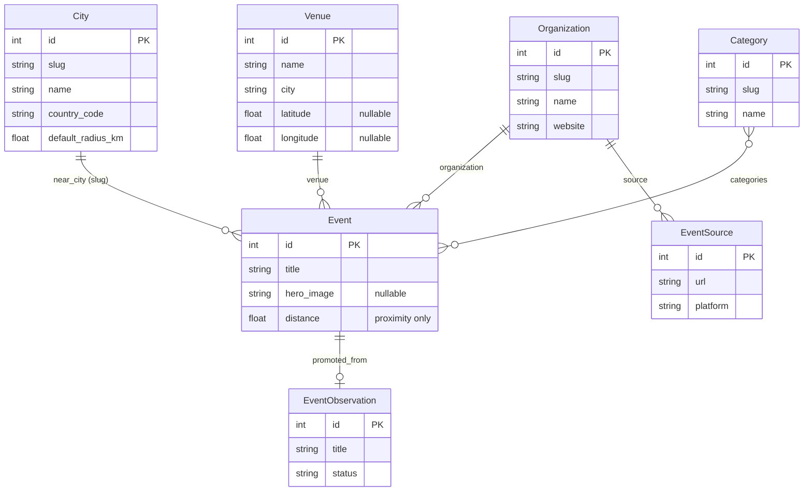

# Data model (client-side)

These are the TypeScript types the demo client renders (`src/api/types.ts`), mirroring
the backend serializers (`events/serializers.py`, `locations/serializers.py`). They are
validated at runtime by the zod schemas in `src/api/schemas.ts`. When the backend's
OpenAPI schema is exported, `src/api/schema.ts` is generated by `openapi-typescript` and
the aliases below can be re-pointed at it for a single source of truth.

## Relationships



## `City`

| Field | Type | Notes |
| --- | --- | --- |
| `id` | number | |
| `geoname_id` | number \| null | |
| `name` | string | used by the `city` exact filter (combobox `valueKey="name"`) |
| `slug` | string | used by `near_city` (combobox `valueKey="slug"`) |
| `country` | string | |
| `country_code` | string | e.g. `DE`; shown as `name, country_code` in comboboxes |
| `latitude` | number \| null | |
| `longitude` | number \| null | |
| `default_radius_km` | number | used when `radius_km` is blank on a `near_city` query |
| `population` | number \| null | |
| `timezone` | string | |

## `Event`

| Field | Type | Notes |
| --- | --- | --- |
| `id` | number | |
| `title` | string | |
| `description` | string | |
| `starts_at` | string | ISO 8601 |
| `ends_at` | string \| null | |
| `hero_image` | string \| null | absolute URL; UI falls back to `/placeholder-hero.svg` |
| `venue` | Venue \| null | null for online events |
| `organization` | Organization \| null | |
| `categories` | Category[] | |
| `capacity` | number \| null | |
| `status` | `"draft"` \| `"published"` \| `"cancelled"` \| `"archived"` | public queryset forces `published` |
| `event_type` | `"meetup"` \| `"conference"` \| `"workshop"` \| `"social"` \| `"other"` | |
| `attendance_mode` | `"physical"` \| `"online"` \| `"hybrid"` | online excluded from proximity |
| `published_at` | string \| null | |
| `cancelled_at` | string \| null | |
| `original_url` | string | provenance |
| `original_platform` | string | provenance |
| `source` | EventSource \| null | provenance |
| `promoted_from` | EventObservation \| null | provenance |
| `created_by` | number \| null | |
| `created_at` | string | |
| `updated_at` | string | |
| `distance` | number \| null | **only present on proximity results** |
| `latitude` | number \| null | |
| `longitude` | number \| null | |

> `owner_group_id` is **not** here — the backend serializer declares it `write_only`, so
> it never appears in responses. The zod `EventSchema` must not require it.

## `Venue`

| Field | Type | Notes |
| --- | --- | --- |
| `id` | number | |
| `name` | string | |
| `address` | string | |
| `city` | string | what `?city=` matches |
| `latitude` | number \| null | |
| `longitude` | number \| null | |
| `capacity` | number \| null | |

## `Organization`

| Field | Type | Notes |
| --- | --- | --- |
| `id` | number | |
| `name` | string | |
| `slug` | string | detail route + `organization_slug` filter |
| `description` | string | |
| `website` | string | |

## `Category`

| Field | Type | Notes |
| --- | --- | --- |
| `id` | number | |
| `name` | string | |
| `slug` | string | |

## Nested provenance types

### `EventSourceNested`

| Field | Type |
| --- | --- |
| `id` | number |
| `url` | string |
| `platform` | string |

### `EventObservationNested`

| Field | Type | Notes |
| --- | --- | --- |
| `id` | number | |
| `title` | string | |
| `starts_at` | string | |
| `url` | string | |
| `platform` | string | |
| `status` | `"pending"` \| `"accepted"` \| `"rejected"` \| `"promoted"` | |

## Pagination

```ts
interface Paginated<T> {
  count: number;
  next: string | null;
  previous: string | null;
  results: T[];
}
```

`/api/cities/all/` is the one exception: it returns a bare `City[]` (no envelope).

## Enum option lists (for select controls)

`EVENT_TYPE_OPTIONS` and `ATTENDANCE_MODE_OPTIONS` (in `src/api/types.ts`) derive the
label/value pairs for the filter `<Select>`s from the backend choices.